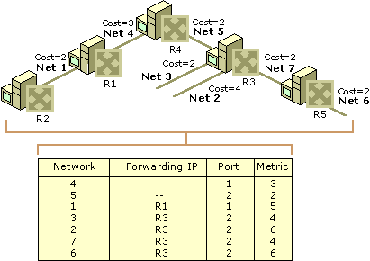

## 4. OSPF
### 4.1. Geef een gedetailleerde beschrijving van de werking van OSPF, inclusief de diverse mechanismen van berichtenuitwisseling en de OSPF routers met een bijzonder functie, maar zonder in te gaan op de uitwerking van het algorite van Dijkstra en het concept van OSPF area's.
#### Algemeen
* OSPF is een interior, link state routing protocol.
* Meldt enkel op welke subnetwerken hij rechtstreeks toegang heeft.
    * Dit melden gebeurt door Link State advertisements (LSA's)
    * Deze worden alle routers van het gehele internetwerk gestuurd.
    * Enkel na heropstarten router of na wijziging in topologie.
*  Doorstromen van informatie gebeurt sunchroon en ontvanger ontvangt een bevestiging. (OSPF  stuurt periodiek niet bevestigde pakketten op).
*  Autonomous System Border Routers (ASBR)
    *  Routers aangesloten op subnetwerken die niet tot het routing domein behoren.
    *  Vermelden netwerken binnen het routing domein  en routes buiten het routing domein die via hen bereikbaar zijn (rechtstreeks en onrechtstreeks). 
        *  Dit zijn external route LSA's
        *  Dikwijls geaggregeerd tot 1 default route LSA

#### Werking
1. Alle routers verzamelt (compileert) de LSA's in een link state database (LSDB).
    * Doordat elke LSA een timestamp heeft weet men het verschil tussen oude en nieuwe informatie.
    * Elke LSA refereert naar 1 router. Met info van de subnetwerken waarop hij aangesloten is, en een metriek die de kost weergeeft. elke router krijgt een router ID die uniek is voor het hele AS. (dit ID is een 32 bit getal net als een IP) meestal is het router ID het grootste IP-adres van de router. De metriek is meestal het quotient *100 / (bandbreedte in MBs)*
    * LSDB bevat volledige inventaris van alle routers en van alle subnetwerken waarop deze een aansluiting hebben.
    * Alle routers bevatten na synchronisatie dezelfde LSDB. (gebeurt efficient zodat netwerkbelasting beperkt wordt.)
2. Als LSDB gecompileerd is, berekent elke router op basis hiervan een routingtabel.
    * Wordt gebruikt om pad met kleinste kost te bekomen (zie algoritme van dijkstra).
    * Men kent volledig pad tot eindbestemming omdat men de volledige LSDB heeft.
    * Elke router berekent een shortest parth first tree (SPF tree) en zichzelf als root. (zie figuur).
    * Hier leidt men de routingtabel uit af. 

3. Synchronisatie van de link state database (2 fases)
    1. Fase 1: Flooding: 
        * Router stuurt LSA met eigen configuratie en LSA's ontvangen van de andere routers (die rechstreeks te bereiken zijn) naar zijn buren.LSA's via interface worden doorgegeven aan de interfaces.
        * Elke router in het routing domein beschikt na een korte tijd over de LSA's van alle andere routers van het routing domein.
        * Er worden adjacencies samengesteld om te vermijden dat elke router met elke andere router zou moeten controleren of hun LSDB's gescynchroniseerd zijn.
            * Adjacencies worden dynamisch gevormd.
            * OSPF router stuurt tijdens initialisatie een Hello pakket (dit bevat eigen router ID als router IDs van naburige routers).
            * Aan de hand van ontvangen Hello pakketten van andere routers vult de router zijn lijst met naburige buren in.
            * OSPF gaat uit van transitiviteit: beschout routers vermeld in Hell pakketten als rechtstreekse buren.
    2. Fase 2: Database Exchange Proces
        *  Elk koppel routers vormt master/slave verhouding, en wisselt Database Description pakketten uit (Beschrijven LSA's met lolly nummer die zich momenteel in deLSDB van een router bevindt.).
        *  Men kan nu detecteren of de router zijn LSDB verouderde informatie bevat.
            * Als verouderd, vraag Link met Link State Request, State Update pakketten op.
        * Adjacency is gevormd als alle koppels alle Link State Request en Link State Update pakketten hebben uitgewisseld en bevestigd. de LSDB wordt enkel uitgewisseld bij topologie wijziging.
4. Periodiek Hello Pakketten 
    * Indien geen pakket na timeout (default 10 seconden), dan router als uitgevallen.
        * Gebeurt ook als router uitgevallen verbinding detecteert. 
5. Als nieuwe router toegevoegd wordt.
    * Deze router en buur wisselen onmiddel Hello pakketten uit.
    * Ze besluiten adjaceny te vormen en Database Description pakketten uit te wisselen
    * Omdat buur router ook LSA's van alle routers bevat wordt huidige router geupdate. (dit met Linke State Requests en Updates)
    * Router 2 stuurt update naar zijn buren.
6. Optimalisaties
    * Beperken Adjacencies
        * Kies Designated Router (DR)
        * Nu moet er enkel adjacency gevormd worden met DR. DR is adjacent met alle routers van het subnetwerk.
        * Als er wijziging vernomen wordt, dan enkel doorgeven aan DR (via multicast 224.0.0.6), deze verspreid het naar de andere routers (via multicast 224.0.0.5).
        * Netwerkbelasting neemt lineair toe met aantal routers. (Niet kwadratisch)
        * Backup designated router (BDR) om bij uitval DR overgansperiode minimaal te houden. BDR neemt enkel over als DR uitvalt en houdt zich voor de rest op de achtergrond.
        * BDR en DR worden verkozen tijdens uitwisseling Hello Pakketten
            * de keuze valt op de hoogste router prioriteit
            * als prioriteit gelijk, neem hoogste router ID's.
            * Als prioriteit = 0, dan geen DR of BDR.

### 4.2. Beschrijf, o.a. aan de hand van een figuur, wat er precies gebeurt indien er een nieuwe router in een door OSPF gestuurd internetwerk wordt opgenomen.
### 4.3. Hoe worden OSPF berichten verpakt (cfr. het OSI 7-lagen model)?